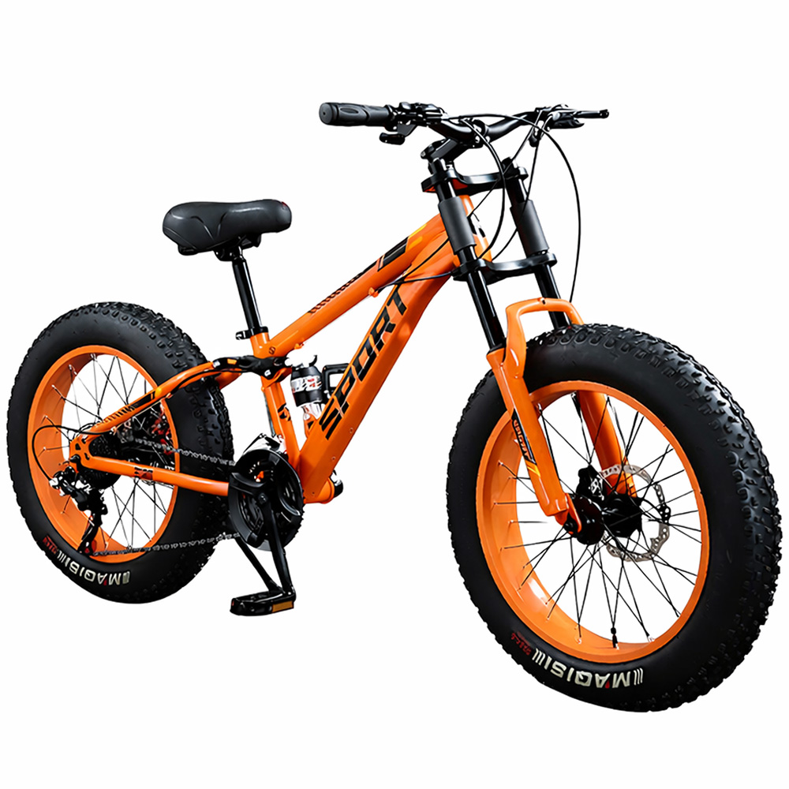

# 오프로드 자전거 추천: 테라로드 MTB 4인치 초광폭 타이어 리뷰

## 들어가며
요즘 들어 자전거 타기 좋아하는 사람들이 많아졌던데, 특히 오프로드 자전거를 타고 싶지만 어떤 자전거를 고르면 좋을지 모르겠다는 사람들이 많아요. 오늘은 오프로드 자전거 중에서 특히 인상 깊었던 '테라로드 오프로드 자전거 MTB 4인치 초광폭 타이어 산악 미끄럼방지 팻바이크 변속'에 대해서 리뷰를 해볼게요. 이 자전거는 산악 지형을 달리는 데 매우 적합하며, 안전하고 안정적인 라이딩을 제공해요.

## 이런 분께 추천해요
- 산악 오프로드 자전거를 처음 타보려는 분들
- 광폭 타이어의 안정성과 미끄럼방지 기능이 필요한 분들
- 다양한 변속 기어를 통해 편안한 라이딩을 원하는 분들
- 경제적인 가격대에서 좋은 성능의 자전거를 찾는 분들

## 주요 특징
### 광폭 타이어의 안정성
테라로드 오프로드 자전거의 가장 큰 장점은 4인치 초광폭 타이어입니다. 이 타이어는 일반적인 자전거 타이어보다 훨씬 너闊해서 지面的 접촉面積이 넓어져 안정성이 높아져요. 특히 언덕이나 계단, 또는 미끄러운 길에서 라이딩 할 때 매우 유용해요.
이 자전거를 타 본 결과, 광폭 타이어로 인해 일반 타이어 자전거보다 훨씬 안정적으로 라이딩할 수 있었어요. 또한, 미끄럼방지 기능으로 인해 خطر한 상황에서도 안전하게 제어할 수 있었어요.
[여기서 구매하기](https://link.coupang.com/re/AFFSDP?lptag=AF8165552&pageKey=9225246035&itemId=27264719969&vendorItemId=95204208319&traceid=V0-153-876cb6a6294fbfe3&clickBeacon=c0f59960-8405-11f1-9b27-d3bca87cae3a%7E3&requestid=20260720153927198188607761&token=31850C%7CMIXED)

### 다양한 변속 기어
이 자전거는 7단의 변속 기어를 제공해서 다양한 지형에서 편안한 라이딩을 할 수 있어요. 언덕을 올라갈 때는 낮은 기어를 사용해서 힘들지 않게 올라갈 수 있고, 내리막길이나 평지를 달릴 때는 높은 기어를 사용해서 속도를 내어 탈 수 있어요.
이러한 다양한 변속 기어로 인해 라이딩의 효율성을 높일 수 있고, 더長い 시간 동안 라이딩을 즐길 수 있어요.

### 가격 대비 성능
테라로드 오프로드 자전거의 가격은 289,000원으로, 같은 성능의 다른 자전거보다 훨씬 경제적이에요. 이런 가격 대비 성능은 매우 합리적이어서, 특히 처음 오프로드 자전거를 타보려는 분들에게 좋은 선택이 될 수 있어요.

## 구매 정보
이 자전거를 구매하려면 [こちら의 링크](https://link.coupang.com/re/AFFSDP?lptag=AF8165552&pageKey=9225246035&itemId=27264719969&vendorItemId=95204208319&traceid=V0-153-876cb6a6294fbfe3&clickBeacon=c0f59960-8405-11f1-9b27-d3bca87cae3a%7E3&requestid=20260720153927198188607761&token=31850C%7CMIXED)를 클릭해 주세요.

## 마무리
테라로드 오프로드 자전거는 광폭 타이어의 안정성, 다양한 변속 기어, 그리고 경제적인 가격으로 오프로드 자전거를 처음 타보려는 분들에게 추천할 수 있어요. 또한, 미끄럼방지 기능과 안정적인 라이딩으로 안전한骑行을 제공해 줘요. 이 포스팅은 파트너스 활동의 일환으로, 이에 따른 일정액의 수수료를 제공받을 수 있습니다.

## 태그
#오프로드자전거 #테라로드 #광폭타이어 #변속기어 #안전한라이딩 #경제적인価格 #초보자추천 #산악자전거 #미끄럼방지 #자전거추천 #라이딩愛好者 #쿠팡파트너스
